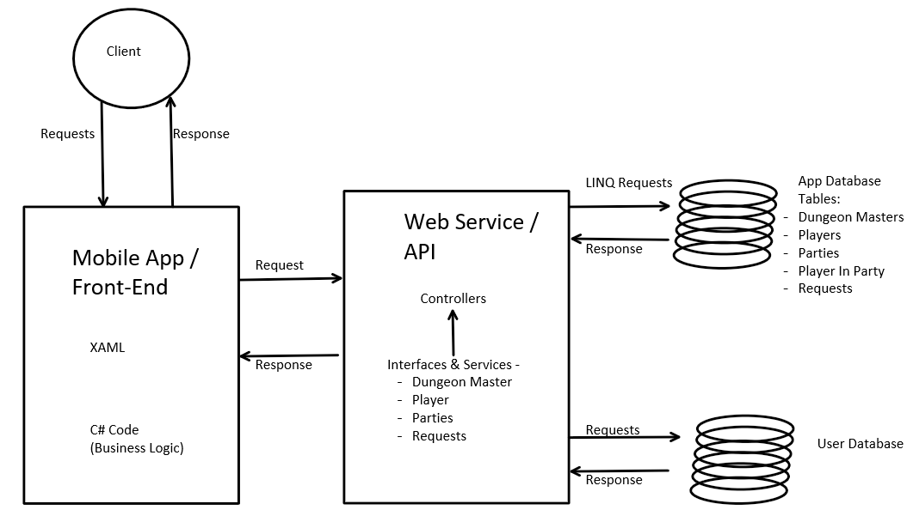
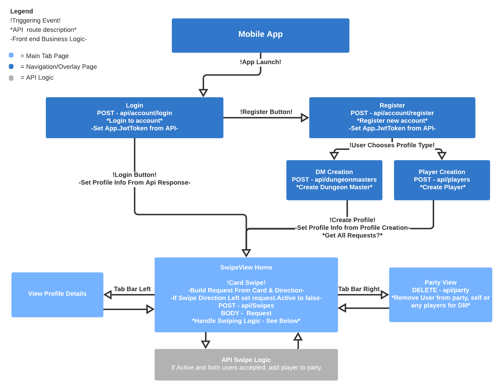

#  FinDnD 
###   What is this?

FinDnD is a mobile application currently in development that will allow users to easily find groups of people that they can play Dungeons and Dragons with. One of the most common sentiments surrounding the game is "it sounds like so much fun but I just don't know anyone to play with", this app seeks to alleviate that. The app allows users to create either a Dungeon Master or a Player profile, where they will give information either about their proposed campaign and themselves as a DM or information about the character they are interested in playing as, respectively. 

Viewing and deciding on party members or dungeon masters is done with swipe cards like many modern dating applications in order to allow a user to view the information about corresponding profile types, and "swiping right" if the DM or player you're viewing seems like a good fit, or left if they don't. Dungeon Master's can oversee their parties, removing members if they choose to, and everyone in a party will have access to the Contact information the other members have supplied.

[Requirements](app-info/requirements.md)

[Wireframes](app-info/wireframes.md)

[Database ERD & Table Descriptions](app-info/database-erd.md)

---

##  Domain Model



---

##  Page Flow


---

##  Frameworks & Tools
- Microsoft Visual Studio 2019
- Frameworks:
  - .NET Core
  - Xamarin.Forms for mobile front-end
  - ASP.NET Core for web service back-end
- Libraries/Tools:
  - SQL Server Database
  - xUnit
  - Entity Framework Core
  - [SwipeCardView](https://github.com/markolazic88/SwipeCardView)

---

##  Changelog
- V 1.0
  - MVP Hit - 9/10/20
- V 0.1
  - Project Start - 9/4/20

---
##  Getting Started
An Android or IPhone emulator with a configured device is required to run this application.

Clone this repository to your local machine.

In a command line environment with Git installed:

```
git clone GIT REPO URL HERE
```

#### To Run the Program from Visual Studio (2019):
Select ```File``` -> ```Open``` -> ```Project/Solution```

Next navigate to the directory you cloned the repository to.

Double click on the ```DndFriendFinderMobile``` directory.

Then select and open ```DndFriendFinder.sln```

Select ```Debug``` -> ```{Chosen Device Name}``` to the run the app with the debugger in the emulator of choice.

---

##  Authors
- [Na'ama Bar-Ilan](https://github.com/NaamaBarIlan) 
- [Yasir Mohamud](https://github.com/Yasir-Mohamud)
- [Nicco Ryan](https://github.com/Niccoryan0)

---

##  Acknowledgements
Special thanks to:
- Amanda Iverson
- Andrew Casper
- Kyungrae Kim

---

##  References
- [Dogs IRL: Xamarin App used for reference](https://github.com/DogsIRLOrg) 
- [C-Sharp Corner: Uploading images in Xamarin](https://www.c-sharpcorner.com/article/xamarin-forms-upload-image-to-blob-storage/)

---