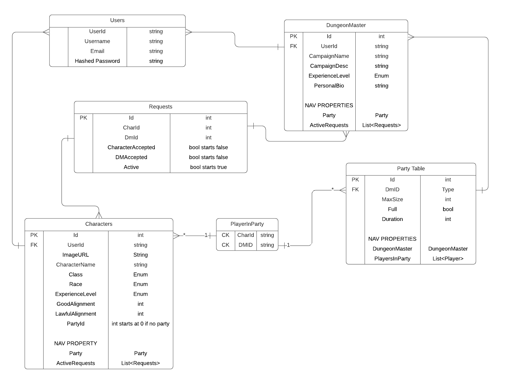

# FinDnD ERD & Table Explanations

---

## Descriptions
### Users
- Handled by Identity Framework and held in a separate Database from the rest of the application.
- Captures a Username, Email and Password for the user on registration.
### DungeonMasters
- Table for keeping track of Users who have chosen a DungeonMaster type profile.
- Info that will be captured on creation is the creating user's Id (foreign key), the name of the DM's current campaign and a short description of it, their experience level as a DM (represented by an Enum), and a short personal bio about their DMing style.
- It will have navigation properties for the DM's Party as well as all Active Requests for the DM.
### Players/Characters
- Table for keeping track of Users who have chosen a Player type profile.
- Info that will be captured on creation in the character's name, enums for their class, race and experience level, integers on a 1-100 representing Good and Lawful alignments, and a partyId will be initially set to 0 to indicate the lack of a party.
- It will have navigation property for the current Party if they are in one as well as all Active Requests from the Request database.
### Parties
- Table for keeping track of formed Parties within the app.
- Parties will be created when a DM is created, it has a foreign key for the DungeonMasterId associated with it, and they will supply the max size for the party and an expected duration of the campaign represented in number of sessions. The table will also contain a Full boolean to easily check if the MaxSize has been reached.
- It will have navigation properties for the DungeonMaster that oversees it and a List of all the players in it via the PlayerInParty app.
### Requests
- Table for tracking the status of all connections between DungeonMasters and Players. Used to know who to display to users when they aren't in a party and keep track of DMs they have already swiped on what the decision was.
- The table will contain Foreign Keys for the CharacterId and DungeonMasterId, as well as boolean values representing if the Character has accepted and if the Dungeon Master has accepted. A third boolean will represent the Active state of the request, starting as true for all, if either user ever "swipes left", this will be set to false, and all requests for a DM will be set to false if their party is full.
- When all 3 values in a Request object become true, we will know a request has been accepted by both individuals and the player can be added to the DM's party. If Active becomes false this request will not be seen again by either user.
- This table will contain navigation properties for the Character and DungeonMaster it's tied to.
### PlayerInParty
- Pure join table for Parties and Players. Combo key made up of CharacterId and PartyId.
